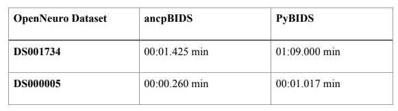

# Introduction to ancpBIDS

ancpBIDS was developed by **Erdal Karaca** as part of his Master Thesis (2022) within the **Applied Neurocognitive Psychology (ANCP) Lab**. It was designed to improve the limitations of **PyBIDS**, another software used for handling I/O (Input/Output) tasks with BIDS compliant dataset. ancpBIDS was able to achieve:

* **Significant performance optimization:** thanks to its [in-memory graph representation](guide/inmemory.md), which efficiently manages the loading process of datasets across multiple layers.
  * A performance benchmark was performed to measure the time execution of both libraries at loading a dataset and querying for all subject labels. ancpBIDS showed to be significantly faster than PyBIDS.

* **Maintainable and clean implementation.** A modular structure helps to control the complexity and minimizes transitive dependencies, making ancpBIDS lightweight and attractive for third-party integration. This design also allows users to contribute additional functionality over time.

* **Support for multiple BIDS schema versions.** ancpBIDS is able to handle different BIDS versions.

## What is BIDS? 

*"Neuroimaging experiments result in complex data that can be arranged in many different ways, and for a long time, there was no consensus on how to organize and share data obtained in neuroimaging experiments. **Brain Imaging Data Structure (BIDS)**, describes a simple and easy to adopt way of organizing neuroimaging and behavioral data"* (Gorgolewski et al., 2016; Niso et al., 2018). 

The **[BIDS Specification](https://bids-specification.readthedocs.io/en/stable/)** defines the rules for data organizing and naming conventions. It is continuously updated thanks to community efforts. To ensure that the Specifications are implemented consistently, BIDS provides **[BIDS Schema](https://bids-specification.readthedocs.io/en/stable/appendices/schema.html)**, a machine readable representation written in YAML format. The BIDS Schema describes objects (definition of BIDS concepts), rules (rules of file path names and contents) and meta (context to which rules can be applied).

You can find more information the BIDS Specification on their [official BIDS webpage](https://bids.neuroimaging.io/).

## PyBIDS limitations
PyBIDS is a library written in Python who utilize the BIDS standard to handle I/O (Input/Output) aspects with BIDS compliant datasets. Over time, its growing capabilities resulted to a large dependency tree, including additional transitive dependencies. Eventually, PyBIDS became a heavyweight library, difficult to maintain with severe performance issues when handling large datasets. These issues made PyBIDS less suitable for individual researchers. 

In agreement with some members of the PyBIDS community, the ANCPlab developed a new version of the PyBIDS library to address its limitations. To ensure backwards compatibility, a compatible version of PyBIDS (pybids-compat) became the core of ancpBIDS.

## Next section
In the next section, we'll walk through the installation and basics for the tutorial.
Also, if you want to learn more how ancpBIDS uses the BIDS specification for its tasks, [follow this link](guide/inmemory.md).
